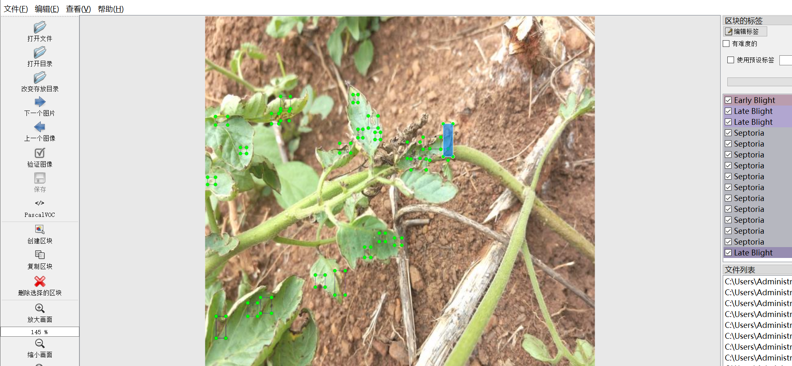
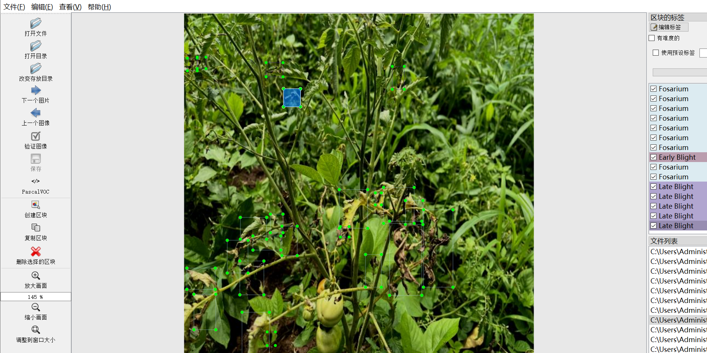
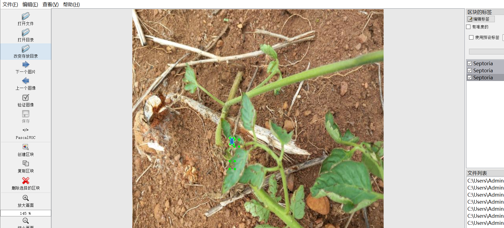
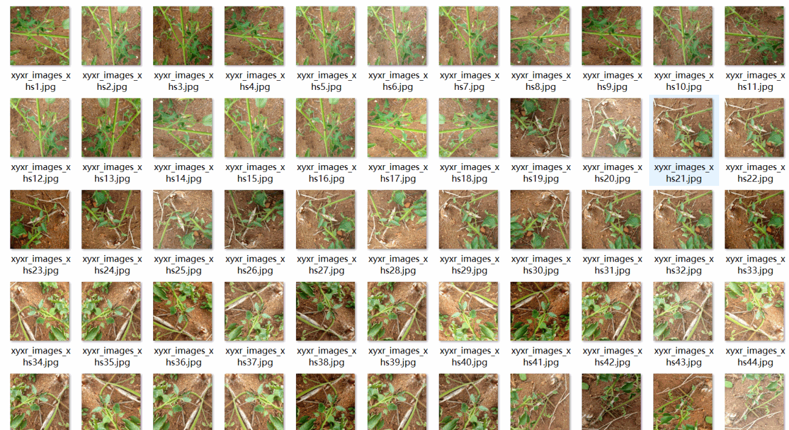

# 【Object Detection JP】Tomato Plant Leaf Disease Dataset 4280 images8-classDisease YOLO+VOC（containing (Augmented) ）

Dataset Format: VOC format + YOLO format

The compressed file contains: three folders, each storing images, xml files, and text files.

Total jpg images in JPEGImages folder: 4280

The XML files in the Annotations folder total: 4280.

The total number of txt files in the labels folder is 4280.

Number of tag types: 8

Tag names: ["Bacterial Spot","Early Blight","Fosarium","Healthy","Late Blight","Leaf Curl","Mosaic","Septoria"]

The number of boxes for each label (Note that the order of labels in the Yolo format does not correspond to this, but is based on the classes.txt file in the labels folder):

Bacterial Spot frame count = 1423

Early Blight frame count = 5693

Fosarium frame count = 2984

Healthy frame count = 9650

Late Blight frame count = 12483

Leaf Curl frame count = 1531

Mosaic frame count = 648

Septoria frame count = 21310

Total boxes: 55722

Picture clarity (Resolution: Pixels): Clear

Image Enhancement: Yes

Shape of the label: Rectangular box, used for object detection and recognition.

Important Note: None

Special Notice: This dataset does not guarantee the accuracy or precision of the trained models or weight files. The dataset only provides accurate and reasonable annotations.

Annotation example:

Image overview:

## Images

---

Here is a pay link on Stripe (https://buy.stripe.com/3cs8yP7sY87d0vu9AB). Please contact me lonlonago@foxmail.com after funding $89, and I will send you a complete data files, thank you!

